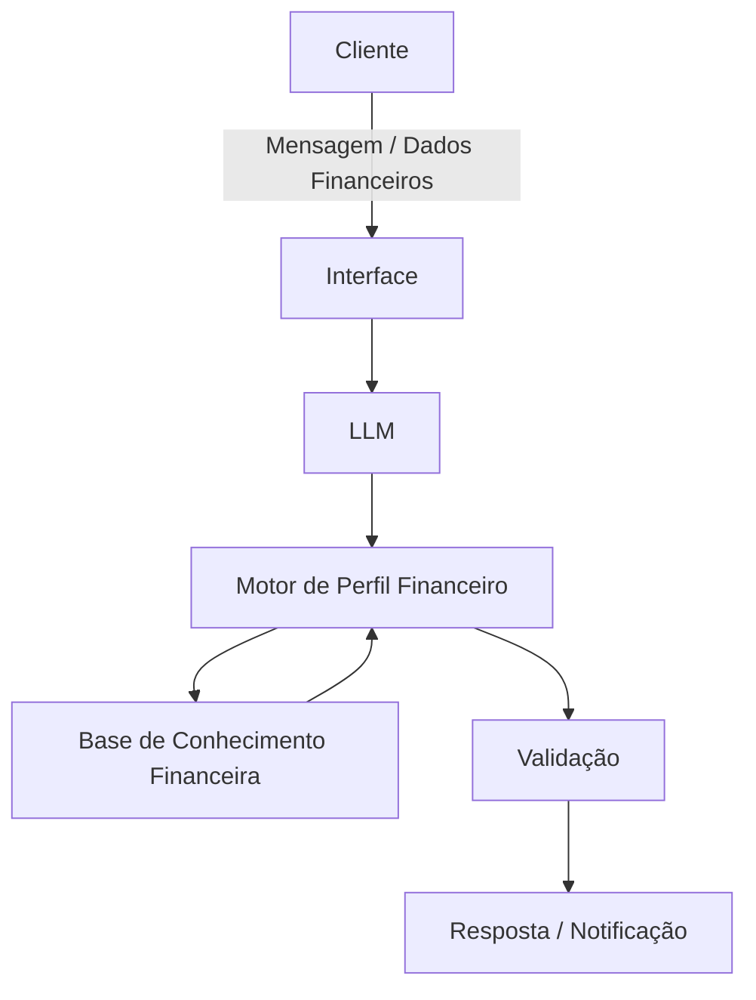

 
  Parte do desenvolvimento deste projeto, incluindo a estrutura inicial do código, documentação e definições conceituais do agente, foi realizada com o auxílio de um modelo de linguagem baseado em Inteligência Artificial (ChatGPT).

As implementações foram construídas a partir de prompts elaborados pela pessoa desenvolvedora, que orientaram a geração de sugestões de código, arquitetura e documentação.

Todo o conteúdo gerado foi revisado, adaptado e integrado ao projeto conforme as necessidades específicas do desenvolvimento.

# Documentação do Agente

## Caso de Uso

### Problema
> Qual problema financeiro seu agente resolve?

Grande parte das pessoas enfrenta dificuldades para gerenciar suas finanças pessoais de forma consistente. Entre os principais desafios estão:

- ausência de planejamento financeiro estruturado;
- dificuldade em acompanhar movimentações financeiras;
- falta de clareza sobre objetivos financeiros;
- ausência de disciplina para executar estratégias de economia ou investimento.

Mesmo quando existe interesse em melhorar a vida financeira, muitas pessoas não possuem um acompanhamento contínuo que oriente decisões cotidianas.

Como consequência, objetivos financeiros — como sair do endividamento, construir patrimônio ou realizar grandes projetos pessoais — acabam sendo adiados ou abandonados.

### Solução
> Como o agente resolve esse problema de forma proativa?

O agente atua como um Guardião Financeiro, responsável por acompanhar as movimentações financeiras do usuário e orientar ações estratégicas para alcançar objetivos financeiros definidos.

O fluxo de funcionamento ocorre em etapas:

### Etapas
**1. Identificação do objetivo financeiro**

No início do atendimento, o agente pergunta qual é o principal objetivo financeiro do usuário, por exemplo:

- sair do endividamento;
- juntar dinheiro;
- realizar uma viagem internacional;
- construir patrimônio;
- internacionalizar investimentos;
- organizar a vida financeira.

**2. Avaliação do perfil financeiro**

Após identificar o objetivo, o agente realiza perguntas estruturadas para entender:

- renda mensal;
- despesas fixas e variáveis;
- nível de endividamento;
- hábitos financeiros;
- horizonte de tempo para atingir o objetivo.

**3. Análise das movimentações financeiras**

Com base nos dados fornecidos ou integrados (ex.: extratos ou registros financeiros), o agente analisa padrões de comportamento financeiro.

*Recomendações estratégicas*

O agente sugere ações práticas, como:
- ajustes no orçamento;
- estratégias de economia;
- priorização de metas;
- organização de fluxo de caixa;
- direcionamento geral para investimentos.

*Monitoramento contínuo*

O agente acompanha a evolução do usuário e envia notificações periódicas contendo:

- status atual da situação financeira;
- alertas de comportamento financeiro;
- dicas estratégicas para manter o progresso rumo ao objetivo.
  

### Público-Alvo
> Quem vai usar esse agente?

O agente foi projetado para:

- pessoas que desejam melhorar sua organização financeira;
- indivíduos que possuem metas financeiras específicas;
- usuários que desejam acompanhar gastos e progresso financeiro;
- iniciantes em planejamento financeiro;
- pessoas que buscam disciplina financeira e acompanhamento contínuo.

---

## Persona e Tom de Voz

### Nome do Agente
Guardião Financeiro

### Personalidade
> Como o agente se comporta? 

O agente possui uma postura:

- analítico
- estratégico
- disciplinador
- orientado a objetivos

Ele atua como um mentor financeiro digital, focado em orientar o usuário de forma prática e consistente para melhorar sua situação financeira.

### Tom de Comunicação
> Formal, informal, técnico, acessível?

O agente utiliza um tom:

- amigável
- motivador
- objetivo
- educativo

O agente utiliza linguagem clara, evitando excesso de tecnicismo, mas mantendo precisão conceitual.

### Exemplos de Linguagem
- Saudação: [ex. *Olá. Vou ajudar você a organizar suas finanças e alcançar seus objetivos financeiros. Qual destes objetivos melhor representa o que você deseja neste momento?*]
- Confirmação: [ex: *Entendi. Seu objetivo é juntar dinheiro para uma viagem internacional. Vou fazer algumas perguntas rápidas para entender sua situação financeira atual.*]
- Acompanhamento: [ex. *Com base nas suas movimentações recentes, seus gastos com lazer aumentaram 18% neste mês. Isso pode impactar o prazo da sua meta.*]
- Erro/Limitação: [ex:*Não consegui identificar informações suficientes para avaliar sua situação financeira atual. Podemos revisar alguns dados para continuar.*]

---

## Arquitetura

### Diagrama

### Componentes

| Componente | Descrição |
|------------|-----------|
| Interface | Aplicação web ou chatbot responsável pela interação com o usuário |
| LLM | Modelo de linguagem responsável pela interpretação das mensagens e geração das respostas |
| Motor de Perfil Financeiro | Sistema responsável por avaliar renda, gastos, metas e comportamento financeiro |
| Base de Conhecimento | Conteúdos sobre planejamento financeiro, economia doméstica e conceitos de investimento |
| Validação | Camada responsável por evitar inconsistências, interpretações incorretas e recomendações inadequadas |

---

## Segurança e Anti-Alucinação

### Estratégias Adotadas

- [X] O agente baseia suas recomendações apenas em dados fornecidos pelo usuário.
- [X] AO agente solicita confirmação quando dados financeiros parecem inconsistentes.
- [X] As recomendações seguem princípios gerais de planejamento financeiro.
- [X] O agente indica quando não possui dados suficientes para análise.

### Limitações Declaradas
> O que o agente NÃO faz?

> [!WARNING]
> O agente não realiza

- consultoria financeira profissional regulamentada;
- gestão direta de investimentos;
- execução automática de transações financeiras;
- previsão garantida de resultados financeiros.
  
As recomendações fornecidas possuem caráter educacional e estratégico, cabendo ao usuário a decisão final sobre suas ações financeiras.

> [!CAUTION]
> Principal Dificuldade do Agente.

O principal desafio do agente é a interpretação correta do comportamento financeiro do usuário a partir de dados incompletos ou inconsistentes.

Diferentemente de assistentes informativos, este agente depende fortemente da qualidade dos dados fornecidos pelo usuário. Problemas comuns incluem:

- ausência de registros financeiros completos;
- categorização incorreta de despesas;
- renda variável ou irregular;
- mudanças frequentes no objetivo financeiro.

Além disso, o agente precisa equilibrar três fatores críticos:

- personalização das recomendações
- segurança financeira do usuário
- simplicidade na comunicação

Outro desafio relevante é evitar recomendações que possam ser interpretadas como aconselhamento financeiro regulado, especialmente em contextos relacionados a investimentos.
